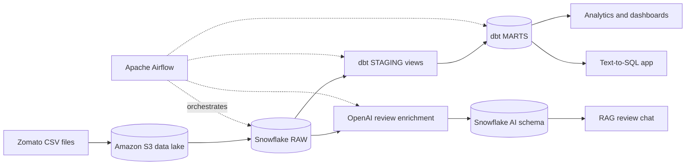
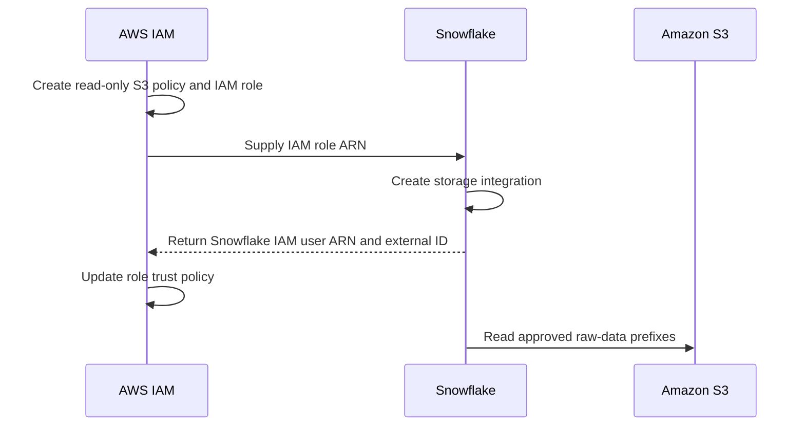
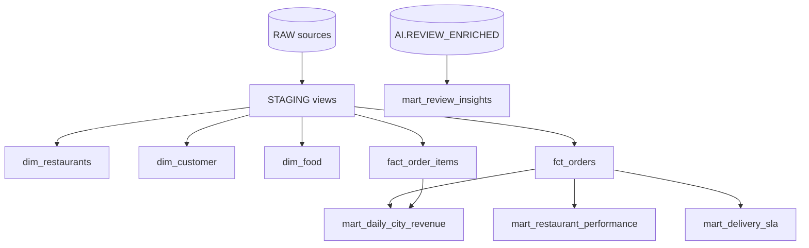

# Zomato AI Data Engineering — End-to-End

An end-to-end batch data platform for large-scale food-delivery analytics. The project lands CSV data in Amazon S3, loads it into Snowflake, transforms it through a dbt medallion architecture, orchestrates daily processing with Apache Airflow, and adds AI-powered review analysis, retrieval, and natural-language querying.


## Architecture




## What the project builds

| Layer | Technology | Responsibility |
|---|---|---|
| Source | CSV | Restaurant, customer, food, menu, order, order-item, and review records |
| Data lake | Amazon S3 | Durable raw storage organized by source table |
| Bronze | Snowflake `RAW` | Source-shaped tables loaded with `COPY INTO` |
| Silver | dbt `STAGING` | Typed, renamed, standardized, and validated views |
| Gold | dbt `MARTS` | Dimensions, incremental facts, and business-facing aggregates |
| AI | Snowflake `AI` + OpenAI | Structured review enrichment, RAG, and guarded text-to-SQL |
| Orchestration | Apache Airflow | Daily dependency-aware execution of the entire batch pipeline |

The intended large-volume run includes approximately 10 million orders, 23 million order items, and 300,000 free-text reviews. Large source files are intentionally excluded from version control.

## Pipeline walkthrough

### 1. Land source files in S3

Seven CSV datasets are uploaded under table-specific prefixes:

```text
s3://<bucket>/raw/restaurants/
s3://<bucket>/raw/users/
s3://<bucket>/raw/food/
s3://<bucket>/raw/menu/
s3://<bucket>/raw/orders/
s3://<bucket>/raw/order_items/
s3://<bucket>/raw/reviews/
```

### 2. Connect Snowflake without stored access keys

Snowflake accesses S3 through a storage integration and a restricted IAM role. The required AWS policy documents are under [`aws/iam/`](aws/iam/).



The final trust policy must use Snowflake's IAM user ARN and external ID. Recreating the integration can generate a new external ID and invalidate the existing trust relationship.

### 3. Load the bronze layer

Snowflake `COPY INTO` commands load the S3 files into source-shaped tables in `ZOMATO.RAW`. Credentials remain outside SQL and application code.

### 4. Transform with dbt

The dbt project in [`zomato/`](zomato/) implements the warehouse model:

- **Staging views:** standardize types, names, email casing, missing values, and delivery flags.
- **Dimensions:** restaurants, customers with age segments, food items, and a generated calendar.
- **Incremental facts:** orders and order items use Snowflake `MERGE` behavior to process new records efficiently.
- **Business marts:** daily city revenue, restaurant performance, delivery SLA percentiles, and review insights.
- **Quality checks:** uniqueness, nullability, relationships, accepted values, and reconciliation tests.



### 5. Orchestrate the daily workflow

[`airflow/dags/zomato_batch.py`](airflow/dags/zomato_batch.py) defines one four-stage DAG:

```text
reload_raw → dbt_build_core → enrich_reviews → dbt_build_ai
```

Airflow reloads Snowflake raw tables, builds and tests the core dbt graph, enriches reviews, and finishes by building the AI-dependent mart.

### 6. Add AI-assisted analytics

The [`ai/`](ai/) directory contains three independent capabilities:

| Application | Purpose | Safety/cost control |
|---|---|---|
| `enrich_reviews.py` | Converts review text into structured sentiment and topic fields | Skips processed reviews and supports `SAMPLE_N` |
| `rag_chat.py` | Retrieves relevant reviews and answers questions using the retrieved evidence | Grounds responses in matching review records |
| `text_to_sql.py` | Translates natural language into Snowflake queries | Applies a SELECT-only validation guard |

The current defaults use `gpt-4o-mini` for generation and `text-embedding-3-small` for embeddings.

## Repository structure

```text
Zomato-AI-Data-Engineering-End-to-End/
├── airflow/
│   ├── dags/zomato_batch.py
│   ├── docker-compose.yaml
│   ├── Dockerfile
│   └── example.env
├── ai/
│   ├── enrich_reviews.py
│   ├── rag_chat.py
│   ├── text_to_sql.py
│   └── example.env
├── aws/iam/
├── docs/architecture.png
└── zomato/
    ├── models/staging/
    ├── models/marts/
    ├── macros/
    └── dbt_project.yml
```

## Getting started

### Prerequisites

- An AWS account and S3 bucket
- A Snowflake account, warehouse, database, and role
- Docker with Compose support
- Python 3.10+
- A dbt-compatible Python environment for local dbt commands
- An OpenAI API key for the optional AI components

### 1. Clone the project

```bash
git clone https://github.com/aromalrm/Zomato-AI-Data-Engineering-End-to-End.git
cd Zomato-AI-Data-Engineering-End-to-End
```

Prepare the seven source CSVs locally, upload them to their corresponding S3 prefixes, and keep the local data directory outside version control.

### 2. Configure AWS and Snowflake

1. Create the S3 read policy and IAM role using the templates in `aws/iam/`.
2. Create the Snowflake storage integration using that role ARN.
3. Retrieve the Snowflake IAM user ARN and external ID with `DESC INTEGRATION`.
4. Apply those values to the final IAM trust policy.
5. Create the `ZOMATO` schemas and raw tables, then configure the stage and file format.

### 3. Build the core dbt project

Create `zomato/profiles.yml` locally. This file is ignored by Git and is required by both the dbt CLI and the Airflow DAG:

```yaml
zomato:
  target: dev
  outputs:
    dev:
      type: snowflake
      account: "{{ env_var('SNOWFLAKE_ACCOUNT') }}"
      user: "{{ env_var('SNOWFLAKE_USER') }}"
      password: "{{ env_var('SNOWFLAKE_PASSWORD') }}"
      role: DBT_ROLE
      database: ZOMATO
      warehouse: ZOMATO_WH
      schema: STAGING
      threads: 4
```

Then export the matching environment variables and build the non-AI models:

```bash
cd zomato
export SNOWFLAKE_ACCOUNT="..."
export SNOWFLAKE_USER="..."
export SNOWFLAKE_PASSWORD="..."
dbt deps
dbt debug
dbt build --exclude tag:ai
```

On Windows PowerShell, set environment variables with `$env:SNOWFLAKE_ACCOUNT = "..."` and the corresponding user/password commands.

### 4. Start Airflow

```bash
cd ../airflow
cp example.env .env
docker compose build
docker compose up -d
```

Fill `.env` with the required `SNOWFLAKE_*`, `OPENAI_API_KEY`, and `SAMPLE_N` values before starting the stack. Open [http://localhost:8080](http://localhost:8080), unpause `zomato_batch`, and trigger a run.

### 5. Run the AI applications

```bash
python ai/enrich_reviews.py
streamlit run ai/rag_chat.py
streamlit run ai/text_to_sql.py
```

## Configuration and security

- Never commit `.env` files, AWS keys, Snowflake passwords, or OpenAI API keys.
- Prefer a Snowflake storage integration over inline AWS credentials.
- Give the Snowflake/dbt role only the privileges required by the pipeline.
- Review generated SQL before expanding the text-to-SQL guard beyond read-only statements.
- Use `SAMPLE_N` during development to bound enrichment cost.
- Large warehouse and AI runs can incur Snowflake, AWS, and OpenAI charges.

## Operational notes

- Incremental facts assume the configured source keys and timestamps reliably identify new or changed records.
- Rerun `dbt build --full-refresh` only when a complete rebuild is intentional.
- Airflow receives credentials through environment variables and its Snowflake connection configuration.
- The source datasets are demonstration data and should not be treated as current Zomato production data.

## Tech stack

Python · pandas · Amazon S3 · Snowflake · dbt-snowflake · Apache Airflow · Docker Compose · OpenAI · Streamlit
